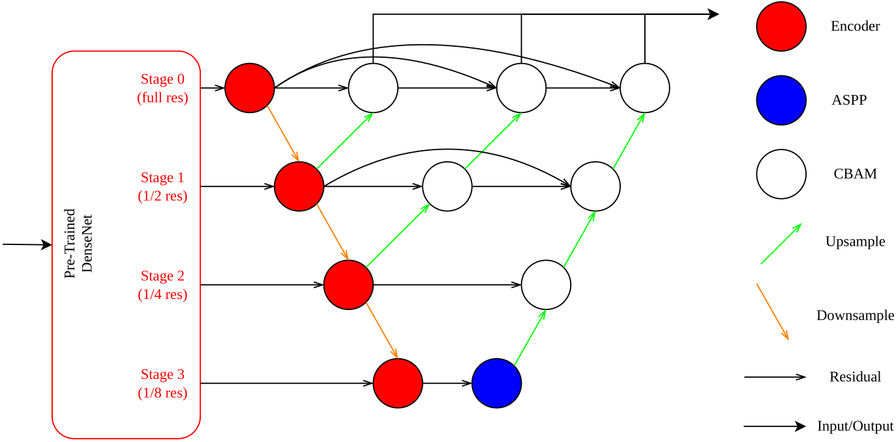
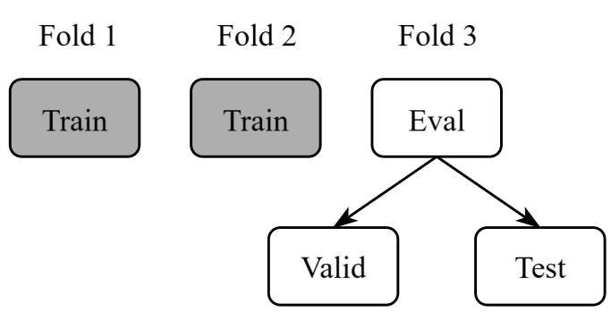
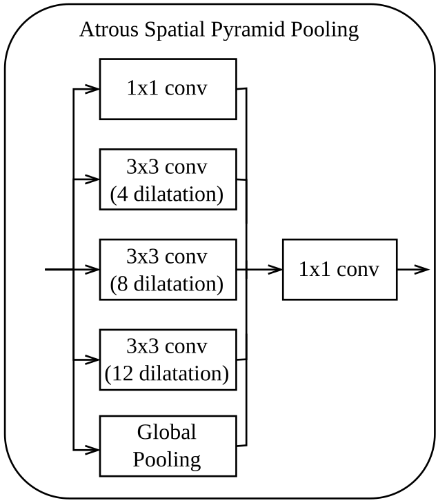
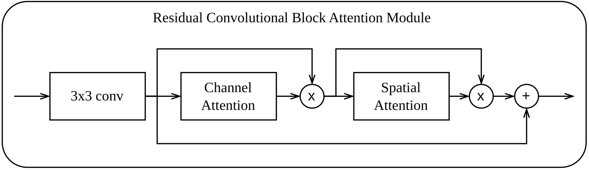
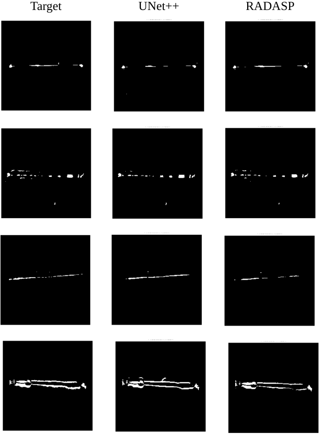
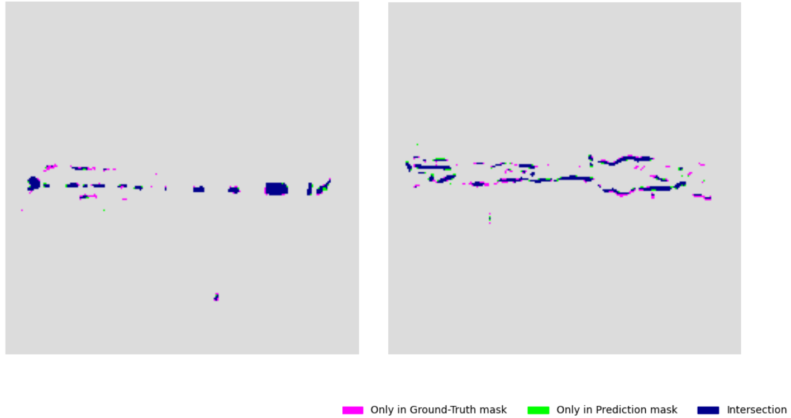

# RADASP
Residual Attention Dense Atrous Spatial Pyramid (**RADASP**) is a lightweight hierarchical encoder-decoder-based segmentation neural network.

## Motivation
RADASP is a custom architectural design developed for anomaly segmentation within X-ray images. It was particularly developed to target a specific industrial dataset. Its development was a critical part of my master's thesis.

The available dataset contains CT scans of welds — 3D data, which are sliced into 2D slices for further processing. The dataset has a limited number of masked slices, which can be effectively used for neural network (NN) training. Specific challenges posed by the dataset include:

* Minimal size (< 100),
* Complex defects,
* Only anomalous samples,
* Imbalance between anomalies and background.

Before the development of RADASP, a **reference baseline** was implemented. This baseline included several state-of-the-art models and established baseline values for evaluation metrics. The results revealed that these "off-the-shelf" models failed to process the dataset effectively. Insights acquired during the baseline implementation were crucial for the RADASP design. The baseline can be found in the [Detection-Baseline](https://github.com/jurkovicmartin/Detection-Baseline) repository.

## Architecture
RADASP follows a leveled structure similar to [UNet++](https://arxiv.org/abs/1807.10165) architecture. It was optimized using 224×224 px grayscale images with [-1024, 1024] pixel value normalization (this nonstandard normalization is due to the chosen backbone).

## Methodology

### Cross-Validation
A 3-fold cross-validation strategy is employed to address the dataset's small size. For each cross-validation iteration, one fold is dedicated to evaluation. This evaluation sub-set is then further divided into a validation set, used for monitoring training progress, and a testing set, which evaluates the model on unseen data.

### Data Augmentation
Data augmentation is also employed to mitigate the small dataset size. By slightly modifying training samples, it creates a more diverse training set, helping the network generalize better and preventing overfitting. The augmentation modifications are listed in the table below:

| **Operation** | **Intensity** | **Impact** |
| :--- | :---: | :--- |
| Horizontal flip | - | Image and Mask |
| Vertical flip | - | Image and Mask |
| Rotation | ±30° | Image and Mask |
| Brightness | ±20% | Image only |
| Gaussian noise | 0.02 standard deviation | Image only |

### Dataset Expansion
The baseline revealed that the performance of every tested model was significantly suboptimal. This resulted in additional dataset refinement, which goal was primarily to increase the data volume and facilitate NN training. This process and utilized techniques are documented in [Dataset-Expansion](https://github.com/jurkovicmartin/Dataset-Expansion) repository.

### Optimizer and Scheduler
**AdamW optimizer**, an extended variant of the classical Adam optimizer, is utilized. AdamW introduces additional weight decay regularization. The scheduler complements the optimizer by gradually decreasing the learning rate, enabling finer tuning later in the training process. A **Cosine Annealing scheduler** is employed, providing a continuous, cosine-shaped learning rate decay.

### Loss Function
The loss function plays a key role during NN training. A combined loss function, consisting of a weighted combination of **Dice loss** and **Focal loss**, was applied during RADASP training. The loss formula is as follows:

$$Loss = (\alpha * Focal) + ((1 - \alpha) * Dice)$$

Where $\alpha$ represents the weighting coefficient.

### Evaluation Metrics
Core evaluation metrics include Intersection over Union (**IoU**), Dice score (**F1 score**), and pixel-level Area Under the Receiver Operating Characteristic Curve (**AUROC**) and Average Precision (**AP**). Additionally, pixel accuracy was included to further illustrate model performance, though it is heavily influenced by the inherent class imbalance.

## Functional Components
RADASP consists of modular function components:

### Encoder
The selected encoder backbone is **DenseNet**, implemented with the [TorchXRayVision](https://github.com/mlmed/torchxrayvision) library. TorchXRayVision provides several pre-trained models for medical image segmentation, trained on chest X-ray images. This selection is motivated by the textural similarity between industrial X-rays and medical X-rays, which is often greater than with standard ImageNet backbones.

### Atrous Spatial Pyramid Pooling
Atrous Spatial Pyramid Pooling (**ASPP**) is a module that provides the decoder with multi-scale feature representations. It utilizes dilated convolutional layers to help the network preserve global context with a large receptive field, even within the network bottleneck.

### Convolutional Block Attention Module
Convolutional Block Attention Module (**CBAM**) utilizes a dual attention mechanism — channel and spatial attention. This mechanism helps the network focus on more relevant features while partially suppressing background noise. The CBAM module is implemented with an initial convolution layer, creating a residual connection.

## Results
> Note that DASP is explained at the [end of document](#dasp).

| **Model** | **Backbone** | **Data** | **Pixel AUROC** | **Pixel AP** | **IoU** | **F1 score** | **Pixel Accuracy** |
| :---: | :---: | :---: | :---: | :---: | :---: | :---: | :---: |
| SegFormer | MiT-b0 | Initial | 0.718 | 0.289 | 0.198 | 0.305 | - |
| DPT | ViT-base-16-224 | Initial | 0.504 | 0.236 | 0.191 | 0.289 | - |
| STFPM | Resnet-18 | Initial | 0.945 | 0.188 | 0.112 | 0.196 | - |
| UNet++ | Resnet-18 | Initial | 0.637 | 0.343 | 0.304 | 0.435 | - |
| DeepLabV3+ | Resnet-18 | Initial | 0.719 | 0.278 | 0.216 | 0.329 | - |
| | | | | | | | |
| UNet++ | DenseNet-121 | Refined | 0.986 | 0.783 | 0.603 | 0.725 | 0.987 |
| DASP | DenseNet-121 | Refined | 0.981 | 0.781 | 0.585 | 0.712 | 0.987 |
| RADASP | DenseNet-121 | Initial | 0.961 | 0.622 | 0.445 | 0.571 | 0.975 |
| **RADASP** | **DenseNet-121** | **Refined** | **0.982** | **0.795** | **0.599** | **0.726** | **0.986** |

The provided table summarizes the results achieved from both RADASP development and baseline implementation. RADASP is primarily compared with UNet++, the top performer from the baseline. The results demonstrate a significant performance improvement over the baseline. Furthermore, a comparison of RADASP with UNet++ under identical conditions proved that RADASP still outperforms UNet++. This performance difference is reached by strategic architectural design, as RADASP achieved better performance despite being more lightweight.

| | **RADASP** | **UNet++**   (baseline) | Absolute   Difference | Difference | **UNet++**   (refined) | Absolute   Difference | Difference |
| :--- | :---: | :---: | :---: | :---: | :---: | :---: | :---: |
| **Pixel AUROC** | 0.982 | 0.637 | 0.345 | **54.16 %** | 0.986 | -0.004 | **-0.41 %** |
| **Pixel AP** | 0.795 | 0.343 | 0.452 | **131.78 %** | 0.783 | 0.012 | **1.53 %** |
| **IoU** | 0.599 | 0.304 | 0.295 | **97.04 %** | 0.603 | -0.004 | **-0.66 %** |
| **F1 score** | 0.726 | 0.435 | 0.291 | **66.90 %** | 0.725 | 0.001 | **0.14 %** |

The picture above illustrates RADASP's ability to capture finer details compared to UNet++. Although RADASP captures more details, it still misses some fragments, as illustrated by the picture below. This might be due to the complex anomaly shapes combined with the partially homogeneous texture of the images. The integration of attention modules addressed this issue, leading to further improvements in evaluation metrics.

## Conclusion
RADASP demonstrates to be the overall top-performing model on the available dataset. Due to its lightweight structure, it is suitable for applications with restricted computational resources or where fast processing is required.

Further work could include benchmarking the model with different datasets to uncover its true potential.

## DASP
The Dense Atrous Spatial Pyramid (**DASP**) architecture, a predecessor to RADASP, is also presented within this repository. The evolution from DASP to RADASP involved the integration of attention modules, specifically Residual Attention (RA). DASP utilized convolutional Visual Geometry Group (VGG) blocks in its decoder. Replacing VGG blocks with the attention mechanism (CBAM) resulted in improved performance and a slightly lighter architecture.

| **Model** | **Total Parameters**   (Including DenseNet backbone) | **Decoder Parameters**   (Without backbone) |
| :--- | :---: | :---: |
| UNet++ | 9 400 932 | 4 447 236 |
| DASP | 8 247 043 | 3 293 347 |
| **RADASP** | **8 003 823** | **3 050 127** |